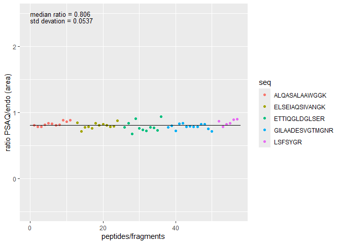

<!-- README.md is generated from README.Rmd. Please edit that file -->

# rPSAQ

<!-- badges: start -->

<!-- badges: end -->

The goal of rPSAQ is to provide an R package to deconvoluate PSAQ+1
(Protein Standard Absolute Quantification) signals from MS2
isotopologues abundances. The package uses the MS2 fragments abundances
to estimate the respective contributions of PSAQ and endogenous peptides
and calculate the abundance ratios between PSAQ and endogenous peptides,
based on fragment intensities or areas.

The package provides a sample MS2 abundances dataset named
`sample_10ng_r4`

## Installation

You can install the current version of rPSAQ from
[GitHub](https://github.com/) with:

``` r
# install.packages("pak")
pak::pak("edyp-lab/rPSAQ")
```

***Note:*** On Windows, to build the rPSAQ package on your system from
source, RTools matching your R version is required
(<https://cran.r-project.org/bin/windows/Rtools/>).

## Example

This is a basic example which shows you deconvolute signals from the
example dataset:

``` r
library(rPSAQ)
## basic example code using the provided dataset
deconvoluted_data = deconvolute_peptides_abundances(sample_10ng_r4)
```

The computed ratios of each fragment can be graphically represented:

``` r
# plot the previously deconvoluted data
plot_psaq_ratios(deconvoluted_data)
```



To write the result, use the openxlsx package:

``` r
openxlsx::write.xlsx(deconvoluted_data, "outputfile.xlsx")
```

The deconvolution can be batch performed from a list of Excel files
stored in a folder. For example to perform deconvolution on all Excel
files starting by “784” and ending with “.xlsx” located in the
“inst/extdata” folder:

``` r
batch_psaq_analysis("inst/extdata", "^784.*\\.xlsx$")
```
